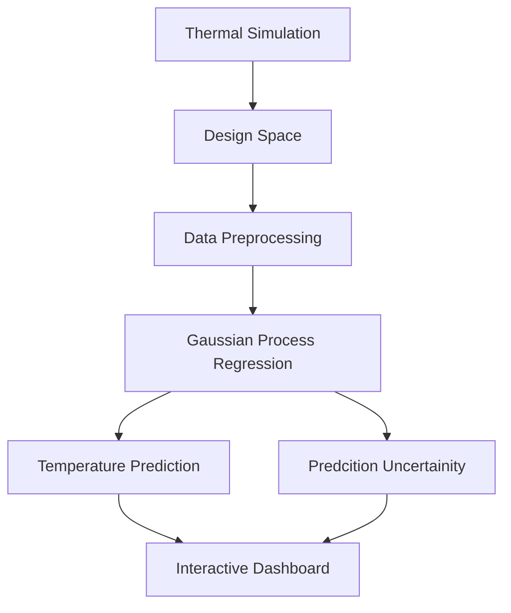
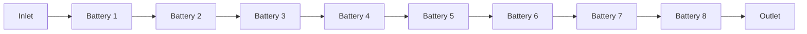
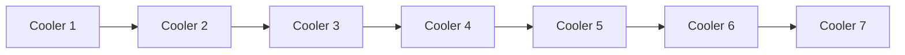
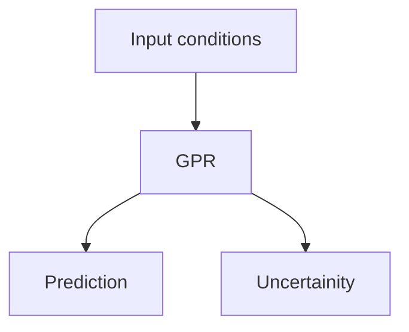
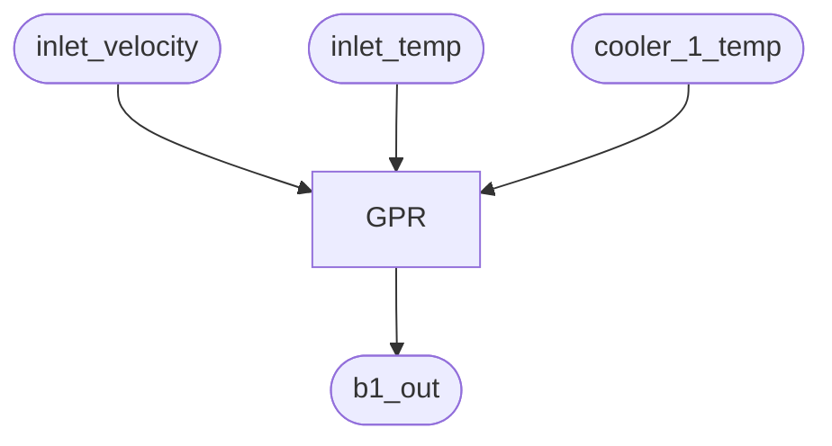
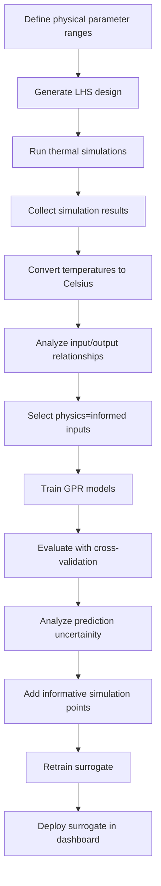

# EV Battery Thermal Surrogate
A physics-informed surrogate modeling framework for an EV battery thermal system.

This project uses thermal simulation data from **ANSYS** to develop a fast surrogate model for battery temperatures across a range of operating conditions. The workflow combines **Latin Hypercube Sampling (LHS)** for design-space exploration, **Gaussian Process Regression (GPR)** for surrogate modeling, and an interactive **Trame + PyVista + Plotly** dashbaord for visualization and inference.

The dashboard provides interactive access to the computationla mesh, input parameters and surrogate predictions.

## Overview
High-fidelity thermal simulations provide detailed information about an EV battery cooling system. nut runninng a new simulation for every operating condition can be computatiionally expensive during design exploration.

This project explores a surrogate-modeling workflow:


The final goal is to replace repeated high-fidelity simulations with a computationally inexpensive surrogate model while retaining information about prediction uncertainity.

## Features
* EV battery thermal simulation surrogate modeling
* Latin Hypercube Sampling for design-space generation
* Gaussian Process Regression
* Physics-informed input selection
* Prediction uncertainity from GPR
* Interactive Trame web application
* PyVista visualization of geometry and mesh
* Plotly interactive result visualization
* Battery-by-battery temperature analysis
* Interactive parameter selection

## Thermal System
The system consists of multiple batteries and cooling components connected in series.
The thermal flow can be represented conceptually as:


The cooling system contains multiple cooler temperature boundary conditions:

## Design Space
The surrogate is intended to operate over a defined range of thermal and flow conditions.
The design variables are:
| Input | Description |
|------ | ----------- |
| `inlet_velocity` | Inlet flow velocity |
| `inlet_temp` | Inlet temperature |
| `battery_temp` | Battery temperature |
| `cooler_1_temp` | Cooler 1 temperature |
| `cooler_2_temp` | Cooler 2 temperature |
| `cooler_3_temp` | Cooler 3 temperature |
| `cooler_4_temp` | Cooler 4 temperature |
| `cooler_5_temp` | Cooler 5 temperature |
| `cooler_6_temp` | Cooler 6 temperature |
| `cooler_7_temp` | Cooler 7 temperature |

Latin Hypercube Sampling is used to generate simulation points that cover the multidimensional design space efficiently.

The intended workflow is:


## Model Outputs
The simulation produces inlet and outlet temperatures for 8 batteries.

The surrogate outputs are:
`b1_in`
`b1_out`
`b2_in`
`b2_out`
`b3_in`
`b3_out`
`b4_in`
`b4_out`
`b5_in`
`b5_out`
`b6_in`
`b6_out`
`b7_in`
`b7_out`
`b8_in`
`b8_out`

All simulation temperature outputs are converted from **Kelvin to Celsius** during preprocessing. `b1_in` is directly related to the inlet temperature `b1_in = inlet_temp` and therefore does not require an independent machine-learning model.

## Gaussian Process Regression
Gaussian Process Regression is used as the primary surrogate modeling technique.
The intial dataset contains approximately **100 simulation samples**.

For a given output, the GPR learns a function:

$$f(\mathbf{x}) \rightarrow y$$
,where:
$$ \mathbf{x} = [inlet\_velocity, inlet\_temp, battery\_temp, cooler\_1\_temp,....,cooler\_7\_temp]$$

The model predicts both :
* predticted temperature
* prediction uncertainity

For a new operating condition:

This uncertainity can be used to identify regions of the design space where additonal high-fidelity simulations may be useful.

## Physics-Informed Input Selection
Not every input necessarily affects every output equally.

For example, `b1_out` is primarily affected by the conditions entering the first cooling stage and the first cooler temperature.

Therfore, rather than blindly using all available variables for every model, the prokect investigates output-specific input selectionbased on the physical topology of the thermal system.

For example:

This reduces unnecessary model inputs and allows the surrogate structure to reflect known physical relationships.

## Intial GPR Results
An initial GPR was trained to predict `b1_out` using the available simulation data.

The intial 80/20 train-test evaluation produced approximately:

| Metric | Value |
| ------ | ----- |
| MAE | 0.0028 °C |
| RMSE | 0.0036 °C |
| R² | 1.0000 |

These values are based on an initial experiment and should **not yet be considered** the final model performance.

Future evaluation will use cross-validation and additonal simulation points to assess generalization across the complete design space.

## Current GPR Results
All invidual models were trained and saved locally.


## Dashboard
The project includes an interactive web dashboard built with:
* **Trame**: application framework
* **PyVista**: mesh visualization
* **Plotly**: interactive result plots


This dashboard is designed to provide a single interface for exploring the thermal simulation and surrogate model.

### Dashboard components


The result visualizations are generated dynamically from the GPR predictions.

### Temperature Gain
For each battery:
$$\Delta T_i = T_{i,out} - T_{i,in}$$
This provides a direct view of the thermal change across each battery.

## Project Structure
```text
Battery-Surrogate/
|
├── assets/
│	└── battery.msh
│
├── data/
│	└── thermal_data.csv
│
├── doe/
│	├── bounds.py
│	├── lhs_samples.csv
│	└── lhs.py
│
├── gpr_models/
│	├── GPR_b1_out_scaler.joblib
│	├── GPR_b1_out.joblib
│	├── GPR_b2_in_scaler.joblib
│	└── ...
│
├── dashboard/
│	├── app.py
│	├── ui.py
│	├── visuals.py
│	├── utils.py
│	└── style.css
│
├── models/
│	├── make_GPRs.py
│	├── call_GPR.py
│	└── utils.py
│
├── plots/
│	└── gpr_error_plot.png
│
├── requirements.txt
└── README.md
```
## Installation
Clone the repository:
```bash
git clone <URL>
```
Create a virtual environment:
```bash
python -m venv .venv
```
Activate it on Windows:
```bash
.venv\Scripts\activate
```
Install dependencies:
```bash
pip install -r requirements.txt
```
## Running the Dashboard
From the project root:
```bash
python dashboard/app.py
```
The Trame application will start locally.

Open the displayed local address in a browser.

The dashboard allows the user to:
* Set the thermal and flow input parameters.
* Run the surrogate model.
* Obtain predicted battery temperatures.
* View the mesh in 3D.
* Explore the resulting thermal behaviour.

## Data
The project uses thermal simulation data containing the input parameters and corresponding battery temperature results.

The current development dataset contains approximately 100 simulation cases. 

```csv
label,inlet_velocity,inlet_temp,battery_temp,cooler_1_temp,cooler_2_temp,cooler_3_temp,cooler_4_temp,cooler_5_temp,cooler_6_temp,cooler_7_temp,b1_in,b1_out,b2_in,b2_out,b3_in,b3_out,b4_in,b4_out,b5_in,b5_out,b6_in,b6_out,b7_in,b7_out,b8_in,b8_out
1,1.24,16.93,34.1,14.89,12.48,11.52,7.61,8.17,5.59,14.78,290.08,292.20148,292.02911,293.9687,293.63087,295.47446,295.0664,296.64833,295.99447,297.33038,296.70058,298.10803,297.37878,298.70121,298.29599,299.44364
2,1.32,19.28,34.07,12.65,5.34,13.59,14.5,9.8,11.57,11.61,292.43,294.24768,293.9213,295.60606,294.93053,296.59414,296.22213,297.64119,297.23013,298.41449,297.81535,299.06302,298.52787,299.68911,299.13303,300.14654
```

For reproducibility, large simulation datasets and simulation files may be hosted separately from the Github repository.

Future versions will provide a dedicated data-download workflow.

## Model Development Workflow
This project is still under development. The current development pipleine is:

## Technologies
| Component | Technology |
| --------- | ---------- |
| Programming | Python |
| Surrogate Model | Gaussian Process Regression |
| DOE | Latin Hypercube Sampling |
| ML | scikit-learn |
| Visualization | Plotly |
| 3D Visualization | PyVista |
| Web Application | Trame |
| Data Processing | Numpy/Pandas |

## Disclaimer
This project is a surrogate-modeling and visualization framework for thermal simulation data. The surrogate model is intended to approximate the underlying simulation within the region covered by its training data.

Predictions outside the sampled design space should be treated with caution, particularly where GPR uncertainty indicates limited training coverage.
